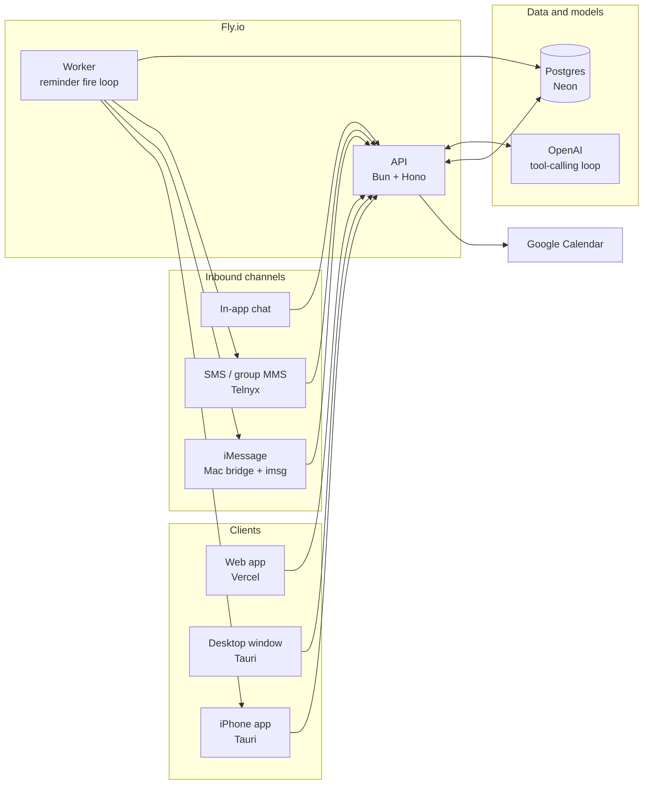
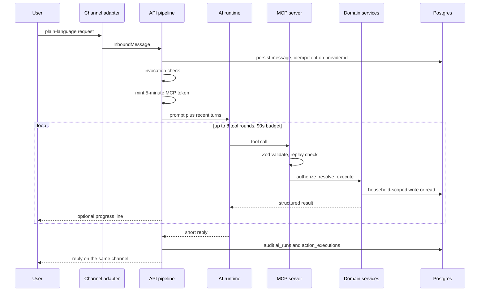
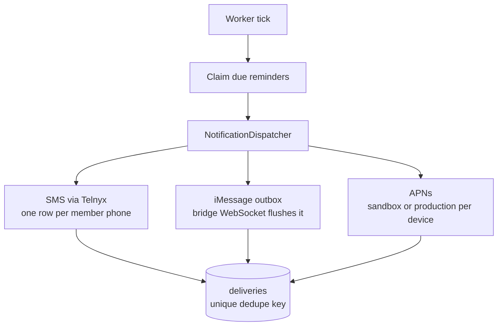
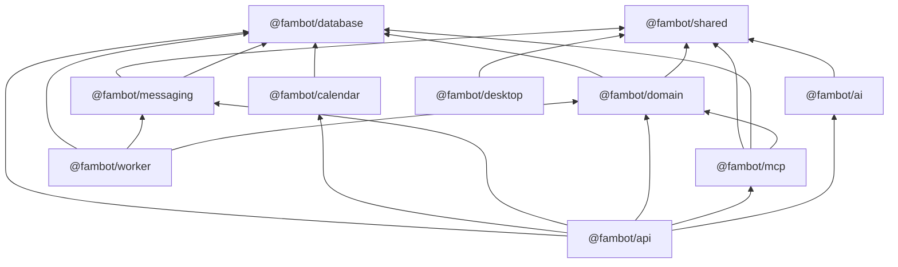

# Fambot

Fambot is a household assistant for reminders, tasks, lists, calendar events, and comments. Family members talk to it in plain language from an iMessage group chat, SMS, or the built-in chat in the web, desktop, and iPhone app. The same pipeline handles every channel.

The model never receives a database connection. It calls a household-scoped [MCP](https://modelcontextprotocol.io) tool surface. Application code validates each call, authorizes it, resolves names and times, and writes Postgres. Scheduled notifications are deterministic: a worker claims due rows and fans them out over SMS, iMessage, and Apple push.



## How a message becomes an action

iMessage, SMS, and in-app chat all become one `InboundMessage`. Nothing after that step knows which channel it came from.



1. **Resolve the conversation.** App chat looks up the conversation id. SMS matches the sender's phone identity, and a group MMS also requires every handset number to belong to the same household. iMessage matches the sender handle. Unknown senders are ignored.
2. **Persist once.** Inserts are unique on `(channel, external_message_id)`. A redelivered webhook returns without running the agent again.
3. **Decide whether to answer.** This check is deterministic. iMessage always needs an `@fambot` mention, including direct messages, because the Mac bridge sees the owner's whole Messages database. SMS and app-chat direct messages always invoke. Group chats need a mention. The household can rename the bot; `@fam` always matches too.
4. **Run the agent.** The API mints a short-lived JWT (`jose`, HS256, 5 minutes) for the acting member and calls the Vercel AI SDK `generateText` loop against `POST /mcp`. Default model is `gpt-5-mini`. The loop stops after 8 steps or 90 seconds. Tool results are parsed back into a status of `executed`, `rejected`, `clarify`, or `failed`.
5. **Execute inside the domain layer.** Each MCP tool validates arguments with Zod, checks an idempotency key, then calls the executor. The executor authorizes the actor, resolves local datetimes and name references, and calls Postgres services. A failed or ambiguous lookup comes back as data the model can read. It does not throw into the HTTP handler.
6. **Reply on the originating channel.** Progress lines can go out mid-run (capped, and excluded from later model context). The final reply can include links to the task, list, event, or reminder that was created. Those links have a public preview page for SMS and iMessage unfurls.
7. **Audit.** One `ai_runs` row stores provider, model, token counts, latency, and status. Each tool step lands in `action_executions`.

A second, narrower model call summarizes a comment thread when someone asks for the latest status. Comment text is treated as data. If that call fails, the API falls back to a verbatim rendering of the thread. Auth, CRUD, and reminder delivery keep working when `OPENAI_API_KEY` is unset. Chat returns HTTP 503.

## Domain model

| Object | Meaning |
|---|---|
| **Event** | Happens at a time. It is not completable. It can recur (expanded on read; a connected Google Calendar receives the whole series). It can carry notes, reminders, linked tasks, and a checklist. |
| **Task** | An obligation that stays open until someone completes it. A due date is optional and is not itself a notification. Recurring tasks are a series: the worker materializes each occurrence on its fixed schedule, and postponing one occurrence leaves the rest alone. |
| **List** | A checklist. Items check and uncheck only. Standing lists (groceries, packing) need no parent. A list can attach to a task, an event, or both. |
| **Reminder** | A notification schedule. It usually attaches to one task or one event, and the schema forbids both. A one-off reminder with no parent is allowed. On a task, a repeating reminder can run until the task is completed. Completing the task cancels the remaining fires. |
| **Comment** | An append-only note on a task, an event, or a list. Reminders do not have threads. |

Times the model proposes are local wall-clock strings such as `2026-09-09T08:00:00`, with no offset. Luxon applies the household timezone, including DST. Recurrence is an RFC 5545 `RRULE`, evaluated with the `rrule` library in local time. Name references ("Jess", "the trash") are resolved against household members and existing titles. An ambiguous match asks the user which item they meant.

Any household member can create and update shared items. Deleting a list is owner-only. Every lookup is scoped to one household, so cross-household access does not have a query path.

## MCP tools

The server is stateless Streamable HTTP (`@hono/mcp` + `@modelcontextprotocol/sdk`). Each request builds a fresh server bound to one member, re-loaded from Postgres. A token whose member was removed, or whose household no longer matches, is rejected.

Mutating tools accept an optional `idempotency_key`. A retry with the same key returns the stored result from `mcp_tool_calls`.

**Reads:** `get_context`, `list_members`, `list_lists`, `list_tasks`, `list_reminders`, `list_events`, `get_list`, `search_schedule`, `get_comment_status`, `get_notification_channels`.

**Writes:** `create_task`, `update_task`, `complete_task`, `cancel_task`, `create_event`, `create_reminder`, `update_reminder`, `cancel_reminder`, `create_list`, `rename_list`, `delete_list`, `add_list_items`, `update_list_item`, `set_list_item_completed`, `delete_list_item`, `add_comment`, plus link tools that attach a task, list, or reminder to an existing parent.

`complete_task` with an empty reference completes the open task most recently notified in that conversation, so a reply of "done" lands on the right item.

The same Zod contracts live in `@fambot/shared`. The app's REST handlers call the same domain services, so chat and the dashboard cannot drift apart.

## Notifications

The worker polls Postgres (default every 5 seconds). It does two jobs, both with `UPDATE ... FOR UPDATE SKIP LOCKED` and a two-minute lease so a crash retries and a second instance cannot double-claim:

- **Task series.** Occurrences are created up to 24 hours ahead, at most five per series per pass. The unique index on `(series_id, scheduled_for)` makes a retry a no-op.
- **Reminders.** Due rows are claimed, dispatched, then advanced to the next `RRULE` occurrence or marked done. A reminder with `until_completed` is cancelled when its task is no longer open.



Each enabled household channel receives the notification. Default channels on a new household are SMS and iPhone push. iMessage is off until the owner turns it on and points it at a chat. In-app chat is how people talk to Fambot. It is not a notification destination.

Every send is one `deliveries` row per channel and recipient. The dedupe key is `kind:sourceId:occurrence:channel:recipient`. Missing phone numbers, a dead APNs token, or an unconfigured provider are recorded as `skipped` or `failed`. One channel failing does not block the others.

SMS replies and delivery receipts arrive at `POST /api/webhooks/telnyx`. The handler checks the Ed25519 signature, inserts the event (unique on Telnyx's event id), and acknowledges inside Telnyx's two-second window. A background drain turns inbound texts into the same message pipeline and updates delivery status.

## Clients

One React app (`apps/desktop`) ships three ways:

| Surface | How it runs | How it authenticates |
|---|---|---|
| Web | Vite SPA on Vercel. `/api` is rewritten to the Fly API. | Better Auth session cookie |
| Desktop window | Tauri 2 on macOS | Cookie while `tauri dev` talks to the Vite proxy. A bundled build that calls the Fly API uses the same bearer session as iPhone |
| iPhone | Tauri 2 WKWebView, same React UI | Bearer session. A custom-scheme webview cannot hold a cross-site cookie, so the API returns the token in `set-auth-token` and the app stores it locally |

Below the `md` breakpoint the phone layout uses a bottom bar: Overview, Chat, Tasks, Calendar, More. Lists, reminders, connections, and settings live under More. Each task, list, event, and reminder has its own page and a focused chat. While that chat is open, the agent is told which item is on screen.

Sign-in is email and password. When `GOOGLE_CLIENT_ID` and `GOOGLE_CLIENT_SECRET` are set, Google sign-in is offered as well. An account belongs to one household. The owner invites someone by phone. The invite SMS carries a one-time link (7 days, stored as a SHA-256 hash). Accepting it links that person's account to the pending member.

Connecting Google Calendar is a separate OAuth grant (`calendar.events`). Access and refresh tokens are stored with AES-256-GCM under `TOKEN_ENCRYPTION_KEY`. Creating an event writes Google first, then mirrors the row locally, including recurrence as one series. Schedule search merges Google results into the household calendar.

## Repository

Bun workspaces. Apps depend on packages. Packages do not depend upward.

```
apps/
  api/        Hono HTTP API: auth, REST, ingest, Telnyx webhooks, MCP, bridge WebSocket
  worker/     Reminder fire loop and recurring-task materialization
  bridge/     Mac iMessage relay. No model, no database, no business rules
  desktop/    React + Vite client, also the Tauri desktop and iOS shell
packages/
  shared/     InboundMessage, Zod action contracts, invocation matcher, phone normalization
  database/   Drizzle schema and the Postgres client
  domain/     Authorization, timezone and RRULE resolution, services, executor
  ai/         Provider-neutral agent loop, prompts, progress lines, status summaries
  mcp/        Tool registry and the per-request MCP server
  messaging/  Channel router, NotificationDispatcher, Telnyx and APNs adapters
  calendar/   Google Calendar REST client and token encryption
```



The bridge is intentionally outside that graph. It speaks HTTP and WebSocket to the API and shells out to `imsg`.

## Dependencies

Versions below are the ranges declared in each `package.json`. The lockfile is `bun.lock`.

### Runtime and platform

| Piece | Role |
|---|---|
| [Bun](https://bun.sh) 1.1+ | Runtime, package manager, test runner, and the API's WebSocket server |
| TypeScript 5.7 | `tsc --noEmit` in every workspace |
| PostgreSQL  | Local Docker (`fambot-pg`) and [Neon](https://neon.tech) in production |
| [Fly.io](https://fly.io) | API and worker processes from one image (`fly.toml`, `Dockerfile`) |
| [Vercel](https://vercel.com) | Hosts the web build of `apps/desktop` |
| [OpenAI](https://platform.openai.com) API | Tool-calling model. `OPENAI_BASE_URL` can point at a compatible endpoint |
| [Telnyx](https://telnyx.com) | Outbound SMS and group MMS, inbound webhooks |
| Apple Push Notification service | iPhone alerts. Token auth with a `.p8` key. HTTP/2 from the worker |
| Google OAuth and Calendar API | Optional sign-in, and optional per-user calendar sync. Raw REST, no Google SDK |
| [imsg](https://imsg.sh) | Reads and sends iMessage on the owner's Mac |
| [cloudflared](https://developers.cloudflare.com/cloudflare-one/connections/connect-apps/install-and-setup/installation/) | Optional tunnel so local dev can receive Telnyx webhooks |

### API (`apps/api`)

| Package | Use |
|---|---|
| `hono` ^4.9 | HTTP router, CORS, logging |
| `better-auth` ^1.3 | Email/password sessions, optional Google sign-in, bearer plugin for iOS |
| `drizzle-orm` ^0.44 | Queries |
| `zod` ^4.1 | Request bodies |
| `jose` ^6.2 | Signs and verifies delegated MCP tokens |
| `@hono/mcp` ^0.3 | Streamable HTTP transport for `/mcp` |
| `@modelcontextprotocol/sdk` ^1.29 | MCP server primitives |

### Worker, bridge, database, domain

| Package | Where | Use |
|---|---|---|
| `pg` ^8.16 | `@fambot/database` | Postgres driver |
| `drizzle-kit` ^0.31 | `@fambot/database` (dev) | Schema push |
| `luxon` ^3.5 | `@fambot/domain` | Household-timezone datetime math |
| `rrule` ^2.8 | `@fambot/domain` | RFC 5545 recurrence |
| `zod` ^4.1 | `@fambot/bridge` | Bridge config and message frames |

Telnyx and APNs clients are small `fetch` adapters in `@fambot/messaging`. They do not pull in vendor SDKs.

### AI and MCP (`packages/ai`, `packages/mcp`)

| Package | Use |
|---|---|
| `ai` ^7.0 (Vercel AI SDK) | `generateText` tool loop, step limit, abort timeout |
| `@ai-sdk/openai` ^4.0 | OpenAI provider. The runtime only sees a `LanguageModel` |
| `@ai-sdk/mcp` ^2.0 | MCP client the agent uses to list and call tools |
| `@modelcontextprotocol/sdk` ^1.29 | Server implementation behind `/mcp` |
| `zod` ^4.1 | Tool input schemas, including JSON Schema for `tools/list` |

### Web, desktop, and iOS (`apps/desktop`)

| Package | Use |
|---|---|
| `react` / `react-dom` ^19 | UI |
| `vite` ^6 | Dev server and production bundle |
| `tailwindcss` ^4 | Styling, via `@tailwindcss/vite` |
| `radix-ui` ^1.4 | Accessible primitives (shadcn/ui, New York style) |
| `class-variance-authority`, `clsx`, `tailwind-merge` | Component variants |
| `lucide-react` | Icons |
| `@tanstack/react-query` ^5 | Server state |
| `better-auth` ^1.3 | Client session (`better-auth/react`) |
| `recharts` ^3 | Overview charts |
| `react-day-picker` ^10 | Calendar UI |
| `sonner` ^2 | Toasts, including foreground push |
| `cmdk` ^1.1 | Command menu |
| `@tauri-apps/cli` ^2 | Desktop and iOS shells |
| `@tauri-apps/plugin-notification` ^2 | Local notification permission |
| `@spicavi/tauri-plugin-push-notifications` 0.1.0 | APNs registration, foreground payloads, tap routing |

Rust side (`apps/desktop/src-tauri`): Tauri 2, `serde`, `tauri-plugin-notification` 2, and `tauri-plugin-push-notifications` pinned at 0.1.0. The push plugin is iOS-only at runtime. Desktop builds report it unsupported, and the TypeScript adapter never calls it outside Tauri iOS.

Fonts: Outfit, Merriweather, and Fira Code from Fontsource.

## Data stored in Postgres

Drizzle schema in `packages/database/src/schema.ts`. There is no separate migration history in-repo. `bun run db:push` (dev) and `bun run prod:db` (Neon) apply the current schema.

| Area | Tables |
|---|---|
| Auth | `user`, `session`, `account`, `verification` (Better Auth) |
| Household | `households`, `members`, `identities`, `household_invites` |
| Conversation | `conversations`, `conversation_participants`, `messages` |
| Work | `tasks`, `task_series`, `lists`, `checklist_items`, `events`, `reminders`, `comments` |
| Delivery | `deliveries`, `outbox_messages`, `household_notification_channels`, `push_devices`, `telnyx_events` |
| Integrations | `calendar_connections` |
| Audit | `ai_runs`, `action_executions`, `mcp_tool_calls`, `pending_actions` |

`messages.kind` is `message` or `progress`. Progress rows are shown in chat and left out of the next prompt.

## Prerequisites

| What | Why | Install |
|---|---|---|
| [Bun](https://bun.sh) 1.1+ | Runtime and package manager | `curl -fsSL https://bun.sh/install \| bash` |
| Docker | Local Postgres | [OrbStack](https://orbstack.dev) or Docker Desktop |
| [imsg](https://imsg.sh) | iMessage relay binary | `brew install steipete/tap/imsg` |
| OpenAI API key | Message interpretation. Auth and CRUD work without it | [platform.openai.com](https://platform.openai.com/api-keys) |
| [neonctl](https://neon.com/docs/reference/neon-cli) | `env:setup` and `prod:db` against Neon | `brew install neonctl` then `neonctl auth` |
| [flyctl](https://fly.io/docs/flyctl/install/) | Deploy API and worker | `brew install flyctl` then `fly auth login` |
| [cloudflared](https://developers.cloudflare.com/cloudflare-one/connections/connect-apps/install-and-setup/installation/) | Local inbound SMS only (`bun dev --inbound-sms`) | `brew install cloudflared` |
| Rust | Native Tauri desktop and iPhone builds | `curl https://sh.rustup.rs \| sh` |
| Xcode and CocoaPods | iPhone Simulator or device | Mac App Store, then `brew install cocoapods` |

Optional accounts: Telnyx for SMS, Google Cloud for sign-in and Calendar, Apple Developer Program for APNs.

## Local setup

```sh
git clone <this repo> && cd fambot
bun install
bun run env:setup    # writes .env and .env.prod for api, worker, bridge, desktop
bun dev              # Docker Postgres, schema, API, worker, web, and the local bridge
```

`bun run env:setup` copies OpenAI, Google, and Telnyx keys from any existing `apps/api/.env`, discovers the Telnyx number, profile, and public key, fetches the Neon URL via `neonctl`, and generates secrets. Re-run it after changing keys. It will not rotate production secrets that are already set.

`bun dev` starts or reuses the `fambot-pg` container, applies the schema, and runs the API on port 8787, the worker, the web app on port 5173, and (on macOS with `imsg` installed) the iMessage bridge against the local API. Pass `--no-web` to skip Vite, or `--no-bridge` to skip the relay.

Inbound SMS stays pointed at Fly unless you pass `--inbound-sms`. That starts a Cloudflare tunnel and replaces the production Telnyx webhook until you run `bun run prod:telnyx` again. Outbound SMS from the local worker does not need a tunnel.

```sh
bun dev --inbound-sms
```

Open http://localhost:5173, create an account, name the household, and use the Chat tab:

> remind me tomorrow at 8am to pack the kids' lunches
> make sure the trash goes out tonight
> add dinner with Jess Friday at 7 to the calendar
> what's on this week?

### Native desktop window

```sh
cd apps/desktop && bunx tauri dev
```

### iPhone

The same React app runs in a Tauri 2 WKWebView.

One-time setup (full Xcode, not only Command Line Tools):

```sh
bun ios:init
```

That adds the Rust iOS targets and generates the Xcode project under `apps/desktop/src-tauri/gen/` (gitignored). Set `APPLE_DEVELOPMENT_TEAM` in the environment. Do not commit a team ID.

Daily loop. Do not run `bun dev` at the same time. Both want Vite on port 5173.

```sh
bun dev:ios          # Postgres, API, and worker, without Vite
bun ios              # Vite plus the iPhone Simulator
bun ios:device       # Vite on the LAN plus a physical iPhone
bun ios:open         # same, opening Xcode
```

`bun ios:device` sets `TAURI_DEV_HOST` so the phone can reach Vite. The `/api` proxy still forwards to `localhost:8787`, so the session cookie stays first-party.

```sh
bun ios:build                 # dev-signed IPA, bundles apps/desktop/.env.prod
cd apps/desktop && bun ios:build:store
```

`ios:build:store` sets `VITE_APNS_ENV=production` and exports for App Store Connect. Inspect the webview from Safari, Develop, then the Simulator or device.

Bundled IPAs set `VITE_API_URL` to the Fly API. Those builds use bearer sessions. Web and dev-proxy builds keep cookies.

## iPhone app alerts (APNs)

The `push` channel alerts every iPhone that registered in the app, including when the app is closed. Two plugins do the native work: `tauri-plugin-notification` (permission and local notifications) and pinned `tauri-plugin-push-notifications` 0.1.0 (APNs registration, foreground payloads, tap deep-links). `src/lib/notifications.ts` is the only module that touches either.

One-time Apple setup:

1. Install Xcode, launch it once, then `sudo xcode-select -s /Applications/Xcode.app/Contents/Developer` and `brew install cocoapods`.
2. Enroll in the Apple Developer Program and sign in under Xcode, Settings, Accounts.
3. Create an APNs auth key (Certificates, Identifiers & Profiles, Keys, Apple Push Notifications service). Download the `.p8` once, store it outside the repo, and note the Key ID and Team ID.
4. In `apps/api/.env` set `APNS_TEAM_ID`, `APNS_KEY_ID`, and `APNS_PRIVATE_KEY_PATH`. Re-run `bun run env:setup`. It inlines the key as base64. `APNS_BUNDLE_ID` defaults to `app.fambot.desktop`.
5. Run `bun ios:init`, open the generated project, select the team, and add the Push Notifications capability so `aps-environment` is in the entitlements.
6. On device, enable Developer Mode for direct installs.

Xcode-installed builds always get sandbox APNs tokens, even when the app talks to the production API. TestFlight and App Store builds get production tokens. The client reports its environment at registration (`VITE_APNS_ENV=production` is set only by `ios:build:store`). Each `push_devices` row stores it, and the adapter picks the sandbox or production host per row. One fan-out can alert a dev-signed phone and a TestFlight phone together.

With `APNS_*` in `apps/worker/.env`, a reminder created against the local stack alerts a dev phone through sandbox APNs. In the app: Connections, iPhone app alerts, Enable on this device, then Send test push.

Production:

```sh
bun run prod:db
bun run prod:up
bun ios:build
cd apps/desktop && bun ios:build:store
```

Upload the IPA with an App Store Connect API key (that key is separate from the APNs key). Create the App Store Connect record for bundle id `app.fambot.desktop`. Set `ITSAppUsesNonExemptEncryption=false` in the generated Info.plist to skip the export-compliance prompt. Run `bunx tauri icon` once after `ios:init` so the icon set is complete. Bump `bundle.iOS.bundleVersion` in `tauri.ios.conf.json` for each TestFlight upload.

On each phone: install, sign in, open Connections, enable the household iPhone alerts switch (owner, once) and Enable on this device (each member).

Operating notes:

- The app re-registers on launch after the user opts in. A stable `installationId` keeps one row per phone when the APNs token rotates.
- `Unregistered` or `BadDeviceToken` deactivates that row. Re-enable from the phone to register again.
- A tapped notification opens the related task or reminder. A foreground push shows an in-app toast.

## SMS (Telnyx)

SMS is a default notification channel. Members can text the Fambot number, and a reply of "done" can complete the task that was just reminded. Without Telnyx credentials the app still runs. Those deliveries are stored as `skipped`.

1. Buy a US or Canada long-code number that can send SMS and MMS, and attach it to a Messaging Profile. Production US long-code traffic needs 10DLC registration. Group MMS does not support toll-free or short-code senders.
2. Put `TELNYX_API_KEY` in `apps/api/.env` and run `bun run env:setup`. That fills the number, profile id, and webhook public key.
3. Point production inbound SMS at Fly with `bun run prod:telnyx` (also done by `bun run prod:up`). The webhook is `https://fambot-nrogers.fly.dev/api/webhooks/telnyx`.
4. For local inbound SMS, `bun dev --inbound-sms` replaces that webhook until `bun run prod:telnyx` runs again.

If the account has several numbers, set `TELNYX_FROM_NUMBER` before `env:setup`.

Household group texts use Telnyx group MMS: US and Canada `+1` wireless numbers, up to 8 recipients. A direct text to the Fambot number is valid input. When at least two members have phone identities, Fambot replies in the household group.

## Household invitations

Only the owner can invite. Settings, Members, Invite member creates a phone-linked pending member and texts a setup link. The link expires after 7 days. Resending invalidates the previous link. The recipient signs in, then accepts the invite. An account can belong to one household.

Enable or disable SMS, iMessage, and push per household under Connections. Outbound SMS works without a public webhook. Receipts and inbound replies need the Fly URL, or `bun dev --inbound-sms` locally.

## iMessage bridge

The bridge tails Messages through `imsg rpc`, POSTs each relevant text to `POST /api/ingest/imessage`, and holds a WebSocket (`/api/bridge/ws`) for outbound sends: chat replies, progress lines, and reminder fires. It drops its own echoes (the outbound prefix, or a GUID it just sent).

One-time macOS permissions for the terminal that runs the bridge:

- Full Disk Access, so it can read the Messages database.
- Automation access to Messages, approved on the first send.

```sh
bun bridge            # asks local vs prod, then email and password
bun bridge:dev        # http://localhost:8787
bun bridge:prod       # https://fambot-nrogers.fly.dev
```

Only a household owner can authenticate. The CLI checks `/health` before asking for a password. One Mac should relay to one API. Use `bun dev --no-bridge` when you want the local stack without starting the relay.

The API routes a text only when the sender matches a member's iMessage identity (phone or Apple ID email). Add that handle under Settings, or include it on an invite. Unknown senders are ignored.

`apps/bridge/.env`:

| Var | Default | Meaning |
|---|---|---|
| `API_URL` | `http://localhost:8787` | Local API |
| `PROD_API_URL` | `https://fambot-nrogers.fly.dev` | Deployed API |
| `BRIDGE_TOKEN` | generated | Must match the target API |
| `BRIDGE_EMAIL` / `BRIDGE_PASSWORD` | | Optional non-interactive login |
| `IMSG_BIN` | `imsg` | Path to the imsg binary |
| `BOT_MESSAGE_PREFIX` | `Fambot says` | Outbound header and echo filter |
| `STATE_PATH` | `./data/state.json` | Replay cursor. Prod uses `./data/state-prod.json` |

A launchd plist at `deploy/launchd/app.fambot.bridge.plist` can keep `bridge:prod` running.

## Environment

`bun run env:setup` writes these. Do not copy `apps/api/.env` to Fly. That database URL is local Docker.

| Var | Required | Meaning |
|---|---|---|
| `DATABASE_URL` | Yes | Postgres. Docker on dev, Neon pooled on prod |
| `OPENAI_API_KEY` | For chat | Without it, AI chat returns 503 |
| `OPENAI_MODEL` | | Default `gpt-5-mini` |
| `OPENAI_BASE_URL` | | Optional compatible endpoint |
| `BRIDGE_TOKEN` | Yes | Shared secret with the Mac bridge. Different in dev and prod |
| `BETTER_AUTH_SECRET` | Yes | Session signing |
| `MCP_SIGNING_SECRET` | Yes | Signs delegated `/mcp` tokens |
| `TOKEN_ENCRYPTION_KEY` | Yes | AES-256-GCM key for Google Calendar tokens |
| `API_BASE_URL` | Yes | API origin. OAuth callbacks and the MCP URL the agent calls |
| `APP_URL` | Yes | Web app origin. CORS and post-OAuth redirects |
| `GOOGLE_CLIENT_ID` / `GOOGLE_CLIENT_SECRET` | For Google | Sign-in and Calendar OAuth |
| `TELNYX_API_KEY` / `TELNYX_FROM_NUMBER` | For SMS | Enables the SMS channel |
| `TELNYX_PUBLIC_KEY` | For SMS webhooks | Verifies Telnyx signatures |
| `TELNYX_MESSAGING_PROFILE_ID` | | Pins sends and selects the webhook profile |
| `APNS_TEAM_ID` / `APNS_KEY_ID` / `APNS_BUNDLE_ID` / `APNS_PRIVATE_KEY` | For app push | All four required. `env:setup` inlines a `.p8` from `APNS_PRIVATE_KEY_PATH` |

The worker needs `DATABASE_URL`, `TELNYX_*`, `APNS_*`, and `WORKER_POLL_MS` (default 5000). The desktop production build reads `VITE_API_URL` from `apps/desktop/.env.prod`.

## Tests and typecheck

```sh
bun test           # unit tests across packages, API, worker, bridge, and desktop lib
bun run typecheck  # tsc --noEmit in every workspace
```

Coverage includes invocation matching, action schemas, recurrence and name resolution, the executor, MCP tool registry, the agent loop against a fake model, the notification dispatcher, APNs environment selection, bridge framing, and invite tokens. Real iMessage, APNs, and Telnyx sends are manual.

## Dev and prod commands

| What | Dev | Prod |
|---|---|---|
| Fill env files | `bun run env:setup` | same |
| Schema | `bun run db:push` (also via `bun dev`) | `bun run prod:db` |
| Run or deploy | `bun dev` | `bun run prod:up` |
| API only | `bun run dev:api` | Fly `api` process |
| Worker only | `bun run dev:worker` | Fly `worker` process |
| Web | Vite on port 5173 | Vercel (`apps/desktop`) |
| Bridge | `bun bridge:dev` | `bun bridge:prod` |
| Secrets | `apps/*/.env` | `bun run prod:secrets` |
| Telnyx webhook | `bun dev --inbound-sms` | `bun run prod:telnyx` |

`prod:up` creates the Fly app if it is missing, imports secrets, deploys, starts a worker if needed, and points Telnyx at Fly. The split commands are `prod:secrets`, `prod:deploy`, and `prod:telnyx`.

## Production layout

```sh
bun run env:setup
bun run prod:db      # schema to Neon, unpooled URL
bun run prod:up      # Fly app, secrets, deploy, scale, Telnyx webhook
bun run bridge:prod  # Mac bridge to the Fly API
```

- **Postgres.** Neon project `fambot`. `env:setup` writes the pooled URL into `.env.prod` and `.env.fly`. Schema push uses the unpooled URL.
- **API and worker.** Fly app `fambot-nrogers`, one image, two processes (`api` and `worker`). The HTTP service stays up (`min_machines_running = 1`, no auto-stop) because the bridge holds a WebSocket. Machine size is `shared-cpu-1x` with 512 MB. Non-secret `PORT`, `API_BASE_URL`, and `APP_URL` live in `fly.toml`.
- **Web.** Vercel project rooted at `apps/desktop`. `vercel.json` rewrites `/api/*` to the Fly API and serves the SPA for every other path. If the hostname is not `https://fambot-desktop.vercel.app`, change `APP_URL` in `fly.toml` and redeploy.
- **Bridge.** Still on the owner's Mac.

Still done by hand: the Vercel project, the first household owner account, `cloudflared` only when you want local inbound SMS, Apple and Google console setup, and Fly billing.
